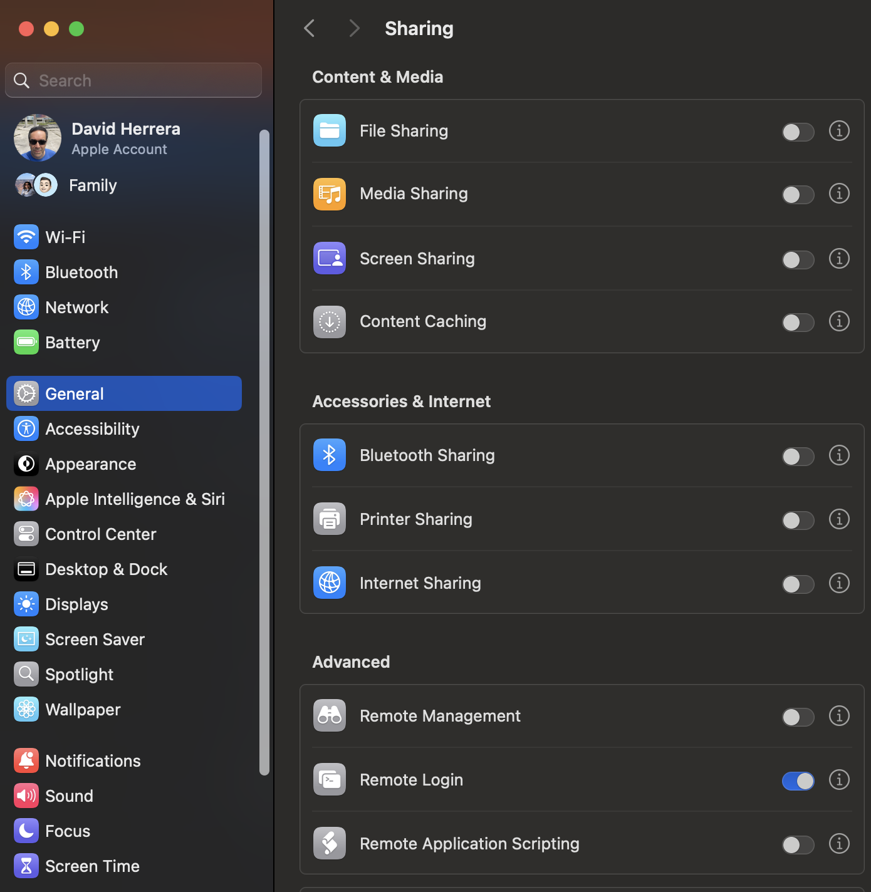

.. _gemvm_sharing_data:

Sharing data with the host
**************************

In order to share files between the VM and your host machine, you can mount a
subdirectory from the host on ``/home/irafuser/vm_transfer``, using ``sshfs``.

Before doing so, your Mac has to have the "Remote Login" option turned on.
In order to do that, you have to go to "System Settings" --> "General" -->
"Sharing" and toggle the button next to "Remote Login" to on, if it's not
already.

|
For example, if your username is ``gumby`` and you wish to copy files to/from
``/home/gumby/data``, you can log onto the VM as ``irafuser`` and issue the
following command:

.. code-block:: none

   sshfs gumby@vmhost:data/ ~/vm_transfer/

where ``vmhost`` is a literal alias for your host machine. Any path after the
colon that doesn't begin with a ``/`` is relative to your home directory.
Remember you're entering the password for ``gumby``, not ``irafuser``.

To umount the shared directory again (so you can mount a different one), type
``fusermount -u ~/vm_transfer``.

  .. note::

     The ``vm_transfer`` directory is intended for sharing input & output
     files, not for processing data in. It's suggested that you keep raw input
     files there and set the ``rawpath`` parameter of the relevant Gemini IRAF
     tasks to point to ``vm_transfer`` from your working directory. Then when
     your data reduction is complete, you can copy the final results back there.

     When using GemVM rather than VirtualBox, you *can* work directly in
     ``vm_transfer`` if you really want to, but data processing will take
     roughly 3-4x as long (and is *already* slow when emulating Intel Linux on
     M1). You can fit about 40GB of data on the VM itself, as long as your host
     machine has that much space available for the expanded disk image.

  .. note::

     If you wish to mount shared directories without having to enter a
     password, you may create an ssh key pair on the VM and install the public
     key (eg.\ ``~/.ssh/id_rsa.pub``) on your host machine. We cannot do that
     for you without compromising your security, but a Web search (eg. for
     "linux ssh key pair login") will turn up many tutorials explaining what to
     do. **Make sure that the disk image (qcow2 file) on your host machine is
     not readable by other users, since it can now be used to gain access to
     your host machine!**

